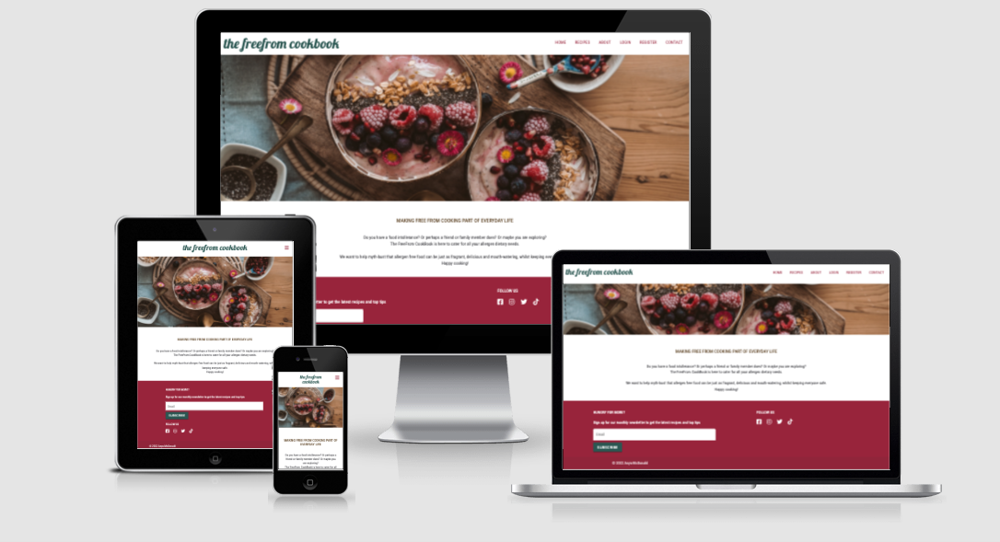
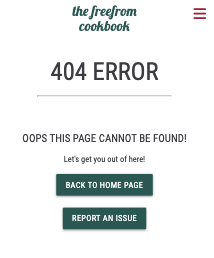
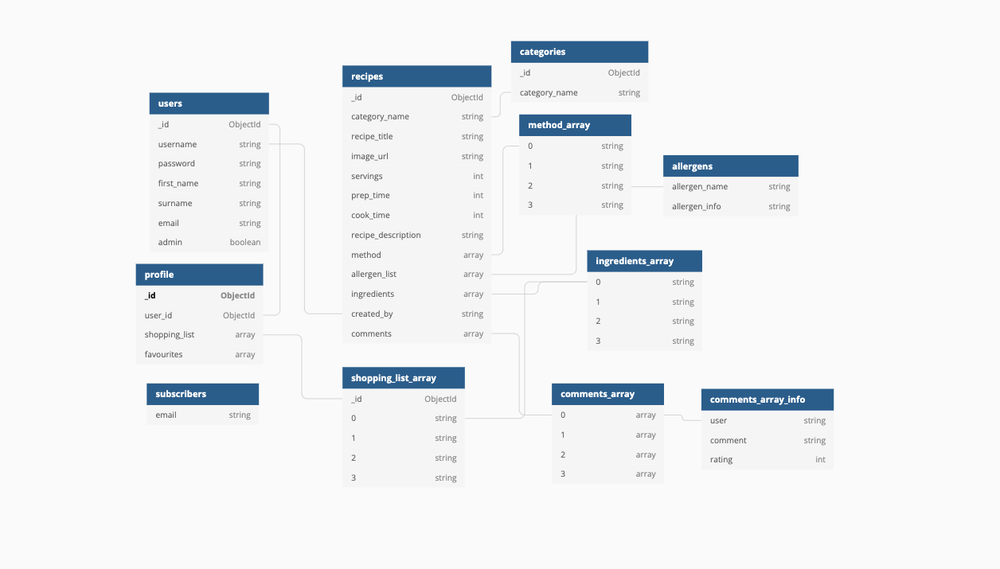
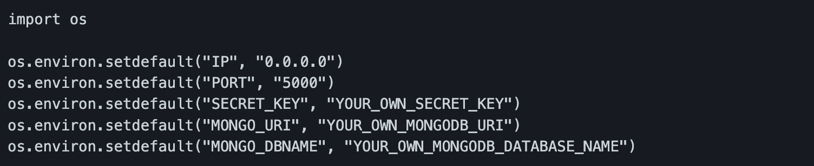
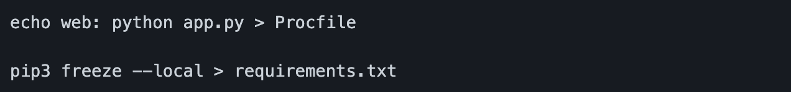

# The FreeFrom CookBook

The FreeFrom CookBook is an online recipe book specifically catering for those with food allergies and intollerances. Last year I was diagnosed with a severe gluten-intollerance. Understanding free-from cooking, scrutinising labels and educating friends and family has quickly become part of my everyday life. I wanted to create a site where people could explore, create and share allergen free recipes in one place and help educate and promote the importance of understanding food allergies and intollerances amongst everyone. Food allergies can be isolating and stressful, so I wanted to create something with a community-feel and help make free-from cooking more easily accessible.

The FreeFrom CookBook has been developed for my Backend Development Milestone 3 Project, as part of my Full Stack Software Development Diploma with Code Insitute. 

Deployed site can be viewed [here](https://the-freefrom-cookbook.herokuapp.com/)

## Table of Contents
1. [Project Goals](https://github.com/anyahush/the-freefrom-cookbook#project-goals)
2. [UX](https://github.com/anyahush/the-freefrom-cookbook#ux-design)
3. [Strategy Plane](https://github.com/anyahush/the-freefrom-cookbook#strategy-plane)
    * [User Stories](https://github.com/anyahush/the-freefrom-cookbook#user-stories)
4. [Scope Plane](https://github.com/anyahush/the-freefrom-cookbook#scope-plane)
    * [Existing Features](https://github.com/anyahush/the-freefrom-cookbook#existing-features)
    * [Future Features]()
5. [Structure Plane](https://github.com/anyahush/the-freefrom-cookbook#structure-plane)
6. [Skeleton Plane](https://github.com/anyahush/the-freefrom-cookbook#skeleton-plane)
    * [Wireframes](https://github.com/anyahush/the-freefrom-cookbook#wireframes)
7. [Surface Plane](https://github.com/anyahush/the-freefrom-cookbook#surface-plane)
8. [Technologies](https://github.com/anyahush/the-freefrom-cookbook#technologies)
9. [Testing](testing.md)
10. [Deployment](https://github.com/anyahush/the-freefrom-cookbook#deployment)
11. [Credits](https://github.com/anyahush/the-freefrom-cookbook#credits)
12. [Acknowledgements](https://github.com/anyahush/the-freefrom-cookbook#acknowledgements)

## Project Goals
- To promote understanding of food allergies and intollerances
- To create a site where users can easily access information and recipes, in addition to creating and saving their own.
- To build a mobile-first responsive site that can be accessed across all devices.
- To display information in user-friendly way, contributing to an overall good user experience.

## UX Design

## Strategy Plane

### Site owner Goals
* To share allergen free recipes
* To promote allergen free recipes
* To highlight and promote importance of understanding allergens
* To encourage users to create an account
* To encourage users to create recipes for the website

### User Stories

As first-time or casual user (as someone who has not registered):
* As a user I want to be able to understand the purpose of the site easily.
* As a user I want to be able to navigate throughout the site with ease.
* As a user I want to experience good responsive design, so I can access the site on different devices.
* As a user I want to enjoy stylish, clean design and style that is inline with the subject of the site.
* As a user I want a variety of recipes for different meals of the day.
* As a user I want to search for allergen specific recipes.
* As a user I want to be able to view recipes without having to create an account.
* As a user I want the option to register for an account, if I want to return later.

As a returning or registered user:
* As a user I want to log into my account.
* As a user I want to be able to delete my account.
* As a user I want to save recipes to my profile.
* As a user I want to create my own recipes.
* As a user I want to edit the recipes I have added.
* As a user I want to delete the recipes I have added.
* As a user I want to save ingredients to my shopping list.
* As a user I want to delete ingredients from my shopping list.
* As a user I want to sign up for a newsletter, so I can stay informed about new recipes.
* As a user I want to find social media links, so I can follow them on different platforms.
* As a user I want to contact admin with queries or feedback.
* As a user I want to find pagination on the recipe pages, so I do not experience endless scrolling.
* As a user I want to leave comments on recipes, so I can share my opinion with other users.
* As a user, I want to leave a rating on a recipe.

As admin:
* As admin I want to edit existing recipes created by any user.
* As admin I want to add new recipes.
* As admin I want to delete existing recipes created by any user.

## Scope Plane

### **Existing Features**
1. Design
    - Simple, clean design and layout with consistency throughout.
    - Easy navigation by using navigation bar. Nav links are clearly idenfied both on desktop and when sidenav is expanded on smaller devices.
    - Responsive design allowing users to use site across all devices.
2. Recipes
    - Recipes can be created, read, updated and deleted (CRUD) by the users.
    - On the create recipe form, the pre-populated allergen dropdown prompts users to select one or more allergens. The purporse of this is to ensure that users check what allergens their recipe is free from before uploading.
    - Users of the site, either logged in or not, can search the recipes either by text input and/or filtering what allergens they want the recipe to be free from.
    - Logged in users can favourite recipes and save them to their profile.
    - Logged in users can save ingredients from recipe pages to their "shopping list" on their profile.
    - Logged in users have access to their profile, where they can view favourite recipes, recipes they uploaded and saved ingredients in their shopping list.
    - Recipe information includes servings, prep and cook times, what allergens it is free from, category, ingredients and the method.
    - Flash messages will appear when users create, edit, delete and favourite recipes and when their shopping list has been updated.
3. Register, Login and Logout
    - Users of the site can create an account.
    - Users can login into their existing account.
    - Users can logout of their account.
    - When a user logs in, logs out or creates a new account a flash message will display informing the user what has been actioned.
4. Contact and Newsletter
    - Users can contact the site owner through a contact form
    - Contact form powered by emailJS
    - On successfull delivery of a contact message, a modal will display informing the user it has been successful with a personalised message.
    - Users can sign up to a newsletter subscription
    - A flash message will display informing user either if subscription has been successful or if the email address already exists in database.

### **Features Left to Implement**
- A section on users home page of recipe suggestions based on type of recipes saved and created in their profile.
- Recipes to display a rating on recipe card based on the average ratings given.
- Users to have ability to edit account, including changing password.
- Users to be able to delete or edit their own comments.
- Admin to be able to edit or delete any users account and comments on recipes.

## Structure Plane
The structure of the site has been developed to enable users to access and use the site with ease.
- Home Page- accessible by all users, whether logged in or not. 
- Navbar- accessible to all users. The navbar changes to a sidenav on tablet screens and smaller for responsiveness. The options available in the navbar change depending on whether a user is logged in or not.
    * For logged in users:  

    * For not logged in users:  

- About Page and Contact Page- accessible to all users, whether logged in or not.
- Recipes library- accessible to all users, whether logged in or not. 
- On recipe card in the recipes library and on individual recipe pages an 'Add to favourites' button is available to logged in users. This allows logged in users, that did not create the recipe, to save recipes to their profile.
- View Recipe Page- Each recipe can be viewed in full and is accessible to all users, whether logged in or not. This page has edit, delete and 'Add to favourites' buttons, 'Save to Shopping List' and a comments section.
- The edit button on the View Recipe Page, is available to admin or the user that created the recipe. This allows the user or admin to edit any part of the recipe and save it.
- The delete button on the View Recipe Page, is available to admin or the user that created the recipe. This allows the user or admin to delete the recipe from the database.
- The 'Save to Shopping List' button allows all logged in users to select ingredients in a recipe and save to a shopping list on their profile.
- Profile Page- this has the users name displayed in the welcome message. On the users profile there are buttons to create a recipe, find recipes in the library and delete account, as well as their shopping list, recipes the user has created and recipes they have saved to their favourites.
- Error Pages have been created incase a user tries to access a page that doesn't exist or there is an issue. 
 
- Database schema design was created using [dbdiagram](https://dbdiagram.io/home), see below.

## Skeleton Plane

### Wireframes

- [Home Page](static/images/readme_images/wireframes/home_page.png)
- [About Page](static/images/readme_images/wireframes/about_page.png)
- [Recipe Search Page](static/images/readme_images/wireframes/recipes.png)
- [Recipe Page](static/images/readme_images/wireframes/view_recipe.png)
- [Create Recipe Page](static/images/readme_images/wireframes/create_recipe.png)
- [Edit Recipe Page](static/images/readme_images/wireframes/edit_recipe.png)
- [Login Page](static/images/readme_images/wireframes/login.png)
- [Register Page](static/images/readme_images/wireframes/register.png)
- [Contact Page](static/images/readme_images/wireframes/contact_page.png)
- [User Profile Page](static/images/readme_images/wireframes/user_profile.png)
- [User Profile Favourite Recipes Page](static/images/readme_images/wireframes/user_profile_favourites.png)
- [User Profile Own Recipes Page](static/images/readme_images/wireframes/user_profile_recipes.png)
- [User Profile Shopping List Page](static/images/readme_images/wireframes/user_profile_shopping.png)

### Changes to Wireframes
There were only a couple of changes to the wireframes during development:
- Instead of a table to display the allergens on the About Page, I decided to use a Materialize collapsible. This allows user to expand information as and when they require. It also minimises the amount of text being displayed at once, which can sometimes be overwhelming to a user.
- On the profile page, initially I was going to have a profile page with three sections(Favourites, Shopping List and My Recipes), which took the user to three different pages. I decided early on in development that this wasn't needed. I want the user to have a good experience and easily access all information. Additionally I didn't feel there would be enough content to fill 3 additional pages. It has been developed that the user has one profile page with all information displayed, clearly laid out in sections.

## Surface Plane

### Colour Scheme
During development I explored different colour palettes and options. I wanted to use a colour scheme that was both pleasing to the using, and contributed to an overall stylish and simple design. Whilst researching, I explored what different colours represent. Green is often associated with nature and is often viewed as a calming colour. I decided that I wanted my site to be a grounded experience for the user rather than overly garish or exciteable. From that, and using green as a central colour, I used [Coolors](https://coolors.co/),  to determine a colour palette. 

Initially this palette was chosen:

After further exploration and development these colours were chosen:

### Images

The images in the site have been selected to showcase delcious, inviting free-from food. To highlight, for the purposes of the site the images chosen by admin were chosen and recipes matched. It can't be guaranteed that the recipes displayed are actually allergen free recipes. 

The site consists of:
- A hero image on the Home page
- An image displaying examples of food intollerances on the About Page
- Each recipe image. 
- If the user does not upload an image, an image is provided. 

Images have been used from [Pexels](https://www.pexels.com/) and [Shutterstock](https://www.shutterstock.com/).

### Typography
[Google Fonts](https://fonts.google.com/) was used to choose fonts for the site. Lobster was chosen as the brand logo font, with its flowing, cursive design. Roboto Condensed was chosen for the rest of the site, as it is clear and easy to read. 

## Technologies

### Languages and Libraries
- [HTML5](https://developer.mozilla.org/en-US/docs/Glossary/HTML5)
- [CSS3](https://developer.mozilla.org/en-US/docs/Web/CSS)
- [JavaScript](https://www.javascript.com/)
- [Python](https://www.python.org/)
- [Werkzeug](https://werkzeug.palletsprojects.com/en/2.0.x/)- Flask dependency and used security helpers.
- [MongoDb](https://www.mongodb.com/) used to store database.
- [Flask](https://flask.palletsprojects.com/en/2.0.x/) Micro framework for building applications.
- [Jinga](https://jinja.palletsprojects.com/en/3.0.x/) was used as templating language for all pages throughout. 
- [jQuery](https://jquery.com/) was used for some Materialize elements.
- [Font Awesome](https://fontawesome.com/) was used for icons throughout the site.
- [Google Fonts](https://fonts.google.com/) was used to choose the fonts.
- [Materialize](https://materializecss.com/) was used for responsiveness, styling and elements such as forms, collapasible tables and tabs.

### IDE and Version Control
- [Git](https://git-scm.com/) was used for version control.
- [GitHub](https://github.com/) used for storing the project.
- [GitPod](https://www.gitpod.io/) was used for editing code.
- [Code Institute GitPod Template]() provided GitPod extensions.

### Design and Development
- [dbdiagram](https://dbdiagram.io/home) was used to create database schema diagram.
- [RandomKeygen](https://randomkeygen.com/) was used to generate secret key.
- [Balsamiq](https://balsamiq.com/) was used to create wireframes.
- [Coolors](https://coolors.co/) was used to help form a colour palette for the website.
- [Favicon](https://favicon.io/) was used to create a favicon for the site.

### Validating and Testing
- [Am I Responsive?](http://ami.responsivedesign.is/) used for creating mock ups.
- [Chrome Developer Tools](https://developer.chrome.com/docs/devtools/) was used throughout development to troubleshoot and whilst testing.
- [Lighthouse Performance Testing](https://developers.google.com/web/tools/lighthouse) used to check performance of site.
- [W3C HTML Validator](https://validator.w3.org/) used to validate HTML code.
- [W3C CSS Validator](https://jigsaw.w3.org/css-validator/) used to validate CSS code.
- [JSHint](https://jshint.com/) used to validate JavaScript files.
- [PEP8 online validator](http://pep8online.com/) used to validate Python code.
- [Mobile Friendly Test Google](https://search.google.com/test/mobile-friendly) used to check mobile responsiveness.
- [Lambdatest](https://accounts.lambdatest.com/dashboard) used to check browser compatibility.

## Testing
Testing section for this project can be found [here](testing.md)

## Deployment

This project used GitPod for developement, GitHub to storage the repository, Git for version control and deployed using Heroku.

### Forking the GitHub Repository
The repository can be forked on GitHub, this creates a copy of the repository that can be viewed or amended without affecting the original repository. This can be done using the following steps:

- Login to GitHub and locate the repository as before.
- At the top right of the repository (under your avatar) locate the Fork button and click this button.
- There should now be a copy of the repository in your own GitHub account, which you can amend.

### Cloning the GitHub Repository
A clone of the repository can be made, which will create a local copy on your own computer. Changes can be made to this local copy and it will not affect the original repository. Follow these steps to clone the Sunrise Yoga repository.

- Login to GitHub and locate the repository as before.
- Click the button called "Code".
- Under HTTPS copy the link provided, in this case (https://github.com/anyahush/the-freefrom-cookbook).
- Go to Gitpod or whichever IDE you are using and open the Terminal.
- Change the current working directory to the location where you want the cloned directory to be made.
- Type 'git clone' followed by the url you copied in step 3.
- Press "Enter" to create the local clone.
- You can refer to the GitHub documentation for more detailed information on the above process [here](https://docs.github.com/en/github/creating-cloning-and-archiving-repositories/cloning-a-repository).
- Follow steps in 'Create MongoDB Database', 'Environment Variables and Setting up the App' and 'Heroku and Deployment' for more information on what is required to run The FreeFrom CookBook.

### Create MongoDB Database
A MongoDB account will be required for this.
- Create a new database in MongoDB
- Within database you can create collections. The database for this project was called cookbook and the first collection was called recipes.
- The collections within the database for this project are:
    * allergens
    * categories
    * users
    * subscribers
    * recipes
    * profiles

### Environment Variables and Setting up the App
- Create env.py file containing sensitive information and add to .gitignore. 
- To connect MongoDB database and app, got to MongoDB cluster page and select 'connect'. 
    * Select 'Connect Your Application'
    * Select the correct driver and Python version
    * Copy the string and add to env.py file, populating password and database name.
- The env.py should contain the following: secret key, MongoDB URI and database name.
- [RandomKeygen](https://randomkeygen.com/) was used to generate the secret key.

- Create a requirements.txt file and Procfile by using these commands. 

- These are both required by Heroku. Commit and push your repository.

### Heroku and Deployment
A Heroku account will be required for this.
1. Log into Heroku account and create a new app.
2. Create an original name and choose the region closest.
3. Go to Deploy tab and select your chosen deployment method. For this project GitHub was selected.
4. Enter repository name ("the-freefrom-cookbook) in the Connect to GitHub search box, and select the repository when it appears.
5. Go to Settings and go to Config Vars and click to reveal Config Vars.
6. Add environment variables, matching those entered into the env.py file.

7. Go back to Deploy and select Enable Automatic Deploys. Below you can select to deploy a branch in the manual deploy section.
8. Click to Open App.

## Credits

### Code
- User Authentication and validating the Materialize select dropdown used from Code Institute's Task Manager mini project [Code Institute Task Manager](https://github.com/Code-Institute-Solutions/TaskManagerAuth)
- Regex pattern for users to submit an image url used from [Moviewiki](https://github.com/nlenno1/moviewiki-ms3).
- Code for users to submit ingredients and method steps when creating a recipe and schema design was modified from [Wanderlust Recipes](https://github.com/RussOakham/wanderlust-recipes)
- Pagination code used from [Sustainable Supper Club](https://github.com/timmorrisdev/MS3-sustainable-supper-club/blob/main/app.py)
- [Pretty Pinted](https://www.youtube.com/watch?v=_sgVt16Q4O4&ab_channel=PrettyPrinted) YouTube tutorial and code to capture checkbox activity into Flask.
- [SQL Server Guide](https://sqlserverguides.com/mongodb-find-multiple-conditions/#:~:text=In%20Python%2C%20we%20can%20easily,use%20the%20find()%20method.) on MongoDb find multiple conditions to use multiple conditions in the search function.
- [Pocket Bookcase](https://github.com/natalie-kate/pocket-bookcase) for help with profile function and contact form modal.
- [Stack Overflow](https://stackoverflow.com/questions/6382023/changing-the-color-of-an-hr-element) used to style horizontal lines.
- [Materialize](https://materializecss.com/) used for styling and responsiveness throughout including card panels, tabs and collapsibles.
- [Stack Overflow](https://stackoverflow.com/questions/386281/how-to-implement-select-all-check-box-in-html) for help to create select all functionality on checkbox lists for both create and remove shopping list items.
- [Stack Overflow](https://stackoverflow.com/questions/43076209/changing-materialize-css-navbar-active-color) used to help remove the background colour in Materialize active class on the navbar.
- Modified code from [Stack Overflow](https://stackoverflow.com/questions/12635489/how-to-validate-a-textarea-using-javascript) for validating textarea in contact form.

### Content
Recipes added by the developer/ admin are a mixture of their own recipes, modified and used from various sites, as shown below:
- [BBC Good Food](https://www.bbcgoodfood.com/)
- [Two Peas and Their Pod](https://www.twopeasandtheirpod.com/)
- [Tesco](https://realfood.tesco.com/)

Content about allergens from:
- [Foods Standards Agency](https://www.food.gov.uk/sites/default/files/media/document/top-allergy-types.pdf)
- [Allergy UK](https://www.allergyuk.org/types-of-allergies/food-allergy/)

### Media

#### Images
- Image on About page from [Shutterstock](https://www.shutterstock.com/image-photo/balanced-diet-cooking-culinary-food-concept-300553067)
- Recipe images used to start the database used from [Pexels](https://www.pexels.com/)
- Image used when user does not upload an image used from [Pexels](https://www.pexels.com/photo/person-holding-sliced-vegetable-2284166/)
- Hero image used from [Pexels](https://www.pexels.com/photo/red-and-white-round-fruits-on-brown-wooden-bowl-4099237/)

## Acknowledgements